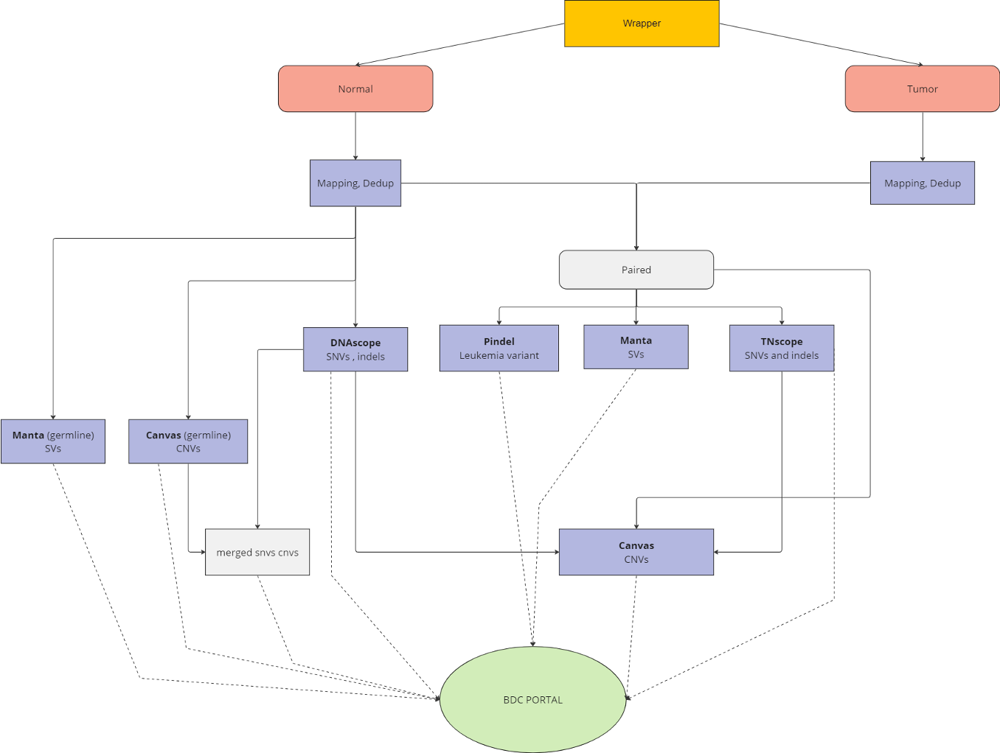

<p align="left">
  <a href="https://github.com/ClinicalGenomicsGBG/wgs_somatic/releases/">
    
  </a>
  <a href="https://github.com/ClinicalGenomicsGBG/wgs_somatic/pulls">
    
  </a>
</p>

## General description

Pipeline for analysis of Whole Genome Sequenced tumor and normal samples. Developed and in use at [Clinical Genomics Göteborg](https://www.scilifelab.se/units/clinical-genomics-goteborg/).

The pipeline takes paired-end Illumina short read sequencing FASTQs as input files from tumor and normal (germline) samples. Depending on the input, the pipeline will perform different tasks.

For paired tumor and normal FASTQs, the results contain:

- Somatic SNV/indels ([TNscope; Sentieon](https://support.sentieon.com/manual/TNscope_usage/tnscope/))
- Structural variants ([Manta; Illumina](https://github.com/Illumina/manta))
- Copy number variants ([Canvas; Illumina](https://github.com/Illumina/canvas))
- Germline SNV/indels ([DNAscope; Sentieon](https://support.sentieon.com/manual/DNAscope_usage/dnascope/))
- Breakpoints from large deletions and SVs ([Pindel](https://github.com/genome/pindel))
- Tumor mutation burden (in-house script; see [Wadensten et al., (2023)](https://doi.org/10.1200/PO.23.00039))

## Manual Usage

### Installation

- Clone the repository and submodules:

    `git clone --recurse-submodules https://github.com/ClinicalGenomicsGBG/wgs_somatic`

- The logs will end up in `/clinical/exec/wgs_somatic/logs`, unless changed in the launcher_config.json (and wrapper_config.yaml)
- If your samples are in slims you can perform a [standalone wrapper run](#standalone-wrapper-run); otherwise continue to [standalone-snakemake-run](#standalone-snakemake-run)

### Standalone wrapper run

```{bash}
#!/bin/bash -l
#$ -cwd
#$ -pe mpi 1
#$ -N wgs_somatic_standalone
#$ -q development.q

module load micromamba
micromamba activate /clinical/exec/wgs_somatic/env/wgs_somatic_env/

python wgs_somatic-run-wrapper.py --tumorsample DNAtumor [--normalsample DNAnormal] [-o outpath] [--copyresults]
```

- The wrapper will automatically download and decompress fastqs where necessary
- The output will be in `/clinical/data/wgs_somatic/manual/` unless specified with `-o`
- The output is not copied to webstore, unless `--copyresults` is added to the command

### Standalone snakemake run

```{bash}
#!/bin/bash -l
#$ -cwd
#$ -pe mpi 1
#$ -N wgs_somatic_standalone
#$ -q development.q

module load micromamba
micromamba activate /clinical/exec/wgs_somatic/env/wgs_somatic_env

python launch_snakemake.py \
    --outputdir <Output directory; required> \
    --normalsample <e.g. "DNA123456", should match beginning of normal fastqs> \
    --normalfastqs <directory containing normal fastqs> \
    --tumorsample <e.g. "DNA654321", should match beginning of tumor fastqs> \
    --tumorfastqs <path to directory containing tumor fastqs> \
    --copyresults <copy results to resultdir_hg38 in launcher_config.json> \
    --notemp <Run the pipeline in notemp mode; all intermediate files kept>
```

- Make sure the FASTQ file names follow the [FASTQ requirements](#fastq-requirements).
- For normal-only analysis (run only germline steps of pipeline), simply don't use arguments tumorsample and tumorfastqs.
- For tumor-only analysis, omit the `--normalsample` and `--normalfastqs` arguments.
- If you include `--development` the pipeline will keep intermediate files, allows rerunning / continuing crashed runs
- If the pipeline was run without `--copyresults`, but you want to copy the results afterwards you can run the command below:

    ```{bash}
    python launch_snakemake.py \
      --outputdir <Same directory as specified when running the pipeline> \
      --onlycopyresults \
      --tumorsample <[Optional] e.g. "DNA654321" to match config with resultdir path> \
      --normalsample <[Optional] If neither tumorsample or normalsample are given, will match with DNA*_config.json>
    ```

### Dependencies

The paths to the dependencies are in configs/config_hg38.json.

They consist of:

- Conda environment specified in `environment.yml`
- Singularity images for analysis tools (definition files in `singularities/`; incomplete)
- Genome, annotations, genelists and databases

When running on the CGG cluster, the dependencies should be set up correctly when cloning the repo.

### FASTQ requirements

For the pipeline to be able to run the following is required for the naming of the FASTQs:

- The filenames must end in `_R{1|2}_001.fastq.gz` or `_{1|2}.fastq.gz` for the `1` and `2` paired-end sequencing files, respectively.
- The provided names of the tumor and normal samples must match the beginning of the FASTQ file.
- When using multiple paired-end FASTQ files to be merged, they must all use the same tumor or normal sample name
  - e.g. `DNA123456_250101_CHIPCHIP_S12_R{1|2}_001.fastq.gz` and `DNA123456_241212_ABCDEFGH_{1|2}.fastq.gz` will be merged
- The pipeline will use the first three parts seperated by `_` to generate the output files
  - e.g, `DNA123456_250101_CHIPCHIP_S12_R{1|2}_001.fastq.gz` becomes `DNA123456_250101_CHIPCHIP`
- The FASTQ filenames cannot contain non-ASCII characters (å, ä, ö, etc.)

## Automatic start of pipeline

The pipeline is started automatically when new runs with GMS-BT/AL samples appear in novaseq_687_gc or novaseq_A01736 Demultiplexdirs.

Cron runs every 30 minutes (in crontab of cronuser)

Wrapper script `wgs_somatic-run-wrapper.py` looks for runs in Demultiplexdir. Every time there is a new run in Demultiplexdir, it is added to text file `/clinical/exec/wgs_somatic/runlists/novaseq_runlist.txt` to keep track of which runs that have already been analyzed. If a new run has GMS-BT/AL samples, the pipeline starts for these samples. Output is placed in working directory `/clinical/data/wgs_somatic/cron/` and the final result files are then copied to webstore. You can find a more detailed description of the automation on GMS-BT confluence page.

## Yearly statistics

After running the pipeline for the first time, a yearly\_statistics text file is created in the repo. Every time the pipeline is run, sample name and date/time is added to this text file.

## Simplified DAG



## Goals

- Have a high quality analysis of all types of genetic abberations (starting with SNVs and InDels, CNVs and SVs).
- Which is fast (because some of these samples can help treatment of urgent pediatric cases).
- Automated and connected to hospital systems so that it is not relied upon bioinformatician working-hours.
- Packaged into Singularities so that it can in the future be run on a cloud-platform like AWS.
- Connected to HCP to upload results and download data for analysis.
- Robust and well-documented to fit into the clinical requirements.
